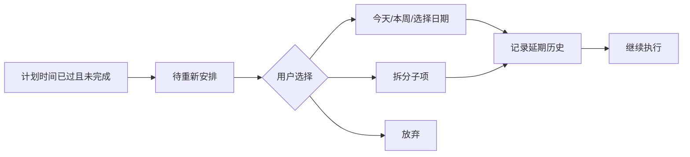
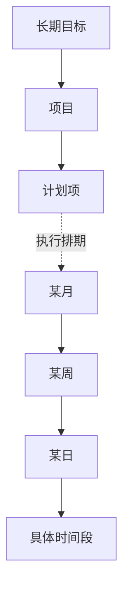

# 不秃 Web MVP 产品需求文档（PRD）

> 文档版本：v0.1  
> 日期：2026-07-14  
> 产品阶段：Web MVP 需求定义  
> 文档状态：初稿，基于产品分析 v0.2  
> 产品负责人：创建者本人  
> 产品名称：不秃
> 目标读者：产品、设计、前端、测试，以及后续参与开发的协作者

## 0. 文档说明

### 0.1 文档目的

本文档将已经确认的产品方向转化为可以设计、开发和验收的具体需求。本文档只描述 Web MVP，不代表 App、Windows 客户端、云同步或 AI 阶段的完整需求。

### 0.2 相关文档

- 产品分析：《2026-07-14-计划软件产品分析-v0.2.md》
- 历史分析：《产品分析文档.md》

### 0.3 需求优先级

| 优先级 | 含义 |
|---|---|
| P0 | MVP 核心闭环必需，缺失则不能发布 |
| P1 | 重要增强，可以在 MVP 主流程稳定后加入 |
| P2 | 后续版本能力，本轮只预留扩展空间 |

## 1. 产品概述

### 1.1 产品定位

一款面向个人的长期计划与日常执行工具。用户可以像使用待办工具一样快速记录，再将事项连接到长期目标，并通过月、周、日和小时日历逐步完成执行排期。系统通过延期处理和复盘帮助用户持续调整，而不是因计划落空而放弃。

> 像待办工具一样轻松记录，像成长系统一样连接长期目标、每日行动与复盘。

### 1.2 用户问题

1. 长期目标与每天执行的任务分散，难以看见日常行动的意义。
2. 创建任务时需要填写的信息过多，临时想法容易丢失。
3. 大计划难以拆成可执行的小步骤。
4. 月、周、日计划彼此割裂，重新安排成本高。
5. 计划延期后容易积压，传统逾期提醒会增加挫败感。
6. 缺少基于真实完成和延期数据的复盘机制。

### 1.3 产品原则

- **先捕捉，后整理**：快速记录只要求标题。
- **目标和时间分离**：父子归属表示“为什么做”，排期表示“什么时候做”。
- **统一计划项**：不强制区分计划、项目和任务，任何计划项均可继续拆分。
- **逐步具体化**：执行安排可以从月逐步明确到周、日和具体时间。
- **允许重新开始**：延期是一条反馈，不是失败判定。
- **本地优先**：首版无需登录，数据默认留在当前浏览器。
- **渐进增强**：AI、云同步和高级规则不得阻碍 MVP 主闭环。

## 2. 产品目标与非目标

### 2.1 MVP 目标

用户能够完成以下闭环：

```text
快速记录 → 设定与拆解目标 → 拖拽排期 → 当日行动
→ 完成或重新安排 → 日/周复盘 → 查看上层进度 → 备份数据
```

### 2.2 MVP 成功条件

- 创建者能够连续使用至少 4 周。
- 每周至少完成一次“规划—执行—复盘”闭环。
- 收集箱内容能够被归入目标、排期、放弃或删除，不长期无决策堆积。
- 逾期任务能够被重新安排、拆分或放弃。
- 日常完成事项能够推动上层计划进度。
- 数据能够完整导出并在空白环境中恢复。

### 2.3 MVP 非目标

- 不实现账号、云数据库和多设备同步。
- 不实现 AI 生成或任何需要付费模型调用的功能。
- 不实现团队协作、共享和权限管理。
- 不实现 App、Windows 客户端。
- 不实现子项权重、自定义标签、人生领域、高级重复规则。
- 不替代专业项目管理、团队协作或复杂甘特图工具。

## 3. 目标用户与核心场景

### 3.1 首要用户

首版服务创建者本人：有长期目标和规划意愿，但容易拖延，需要简单记录、灵活排期、温和延期处理和持续复盘。

### 3.2 核心场景

| 场景 | 用户目标 | 产品结果 |
|---|---|---|
| 临时想到事项 | 立即保存，不被表单打断 | 一行输入后进入收集箱 |
| 设定长期目标 | 把模糊目标拆成可执行内容 | 形成自由层级目标树 |
| 安排未来行动 | 决定某月、某周或某天推进 | 拖拽改变排期，不改变目标归属 |
| 安排今天 | 区分未定时间和具体时间块 | 任务可拖入小时日历 |
| 计划落空 | 重新作出可实现的决定 | 进入待重新安排并保留历史 |
| 周期性行动 | 自动产生每日、每周、每月事项 | 每次执行记录相互独立 |
| 复盘成长 | 看见完成、延期和时间投入 | 自动摘要加引导问题 |
| 更换环境 | 防止本地数据丢失 | JSON 完整备份和恢复 |

## 4. 核心概念

### 4.1 计划项

产品唯一的核心内容对象。计划项可以是人生方向、阶段目标、年度目标、项目，也可以是一个很小的行动。它可以拥有父计划、子计划、计划周期、执行排期、状态、进度和复盘。

### 4.2 目标线

通过计划项的父子关系表达“为什么做”和“服务于什么目标”。层级数量不设硬限制，但界面应避免一次展开过深导致不可读。

### 4.3 执行线

通过月、周、日和具体时间段表达“什么时候推进”。执行排期不参与父子关系计算，也不会因为拖拽而改变计划项所属目标。

### 4.4 计划角色

可选的说明标签，MVP 预设：

- 人生方向
- 阶段目标
- 年度目标
- 项目
- 普通任务

计划角色不限制计划项的层级、状态或排期能力。

### 4.5 周期页面

年、月、周、日首先是系统按日期生成的时间视图；用户可以为某个周期额外填写主题、重点和复盘。周期页面不是计划项的固定父级。

## 5. 信息架构与全局导航

### 5.1 一级页面

| 页面 | 主要目的 | 默认入口 |
|---|---|---|
| 今日 | 执行今天、查看待重新安排和快速记录 | 是 |
| 目标 | 创建、拆解和浏览目标树 | 否 |
| 计划 | 月、周、日排期工作台 | 否 |
| 复盘 | 日、周、月复盘及历史记录 | 否 |
| 设置 | 重复规则入口、导出、备份恢复和显示偏好 | 否 |

### 5.2 全局元素

- 一级导航在所有页面持续可见。
- 全局快速记录入口在所有一级页面可用。
- 当前日期、返回今天、撤销最近操作属于全局能力。
- 收集箱数量和待重新安排数量应在导航或对应入口展示。

## 6. 全局业务规则

### 6.1 时间规则

- 默认使用设备当前时区；MVP 不支持跨时区协作。
- 一周默认从周一开始，周日结束。
- 仅安排到月份时，系统保存该月范围；细化到周、日后，以最新粒度为当前执行排期。
- 设置具体时间必须先有执行日期。
- 有开始时间但未指定时长时，默认预计时长为 30 分钟，用户可以修改。
- 时间块最小调整粒度默认为 15 分钟。
- 完成时间由用户点击完成时记录，不因排期变化而修改。

### 6.2 状态规则

计划项状态固定为：

```text
待办 → 进行中 → 已完成
  └──────────→ 已放弃
```

- 新计划项默认为“待办”。
- 已完成计划可以重新打开为“待办”。
- 已放弃计划可以恢复为“待办”。
- “逾期”“延期”“待重新安排”不是执行状态。
- 已完成和已放弃的计划不进入逾期判断。

### 6.3 父子关系规则

- 一个计划项最多有一个直接父项，可以拥有多个直接子项。
- 根计划没有父项。
- 不允许把计划项设为自己的父项。
- 不允许将计划项移动到自己的任意后代下，防止循环关系。
- 调整父项不改变执行排期。
- 调整执行排期不改变父项。

### 6.4 进度规则

- 没有子项的计划项不显示百分比，以状态表达完成情况。
- 有子项的计划项默认使用自动进度：已完成直接子项数量 ÷ 有效直接子项数量。
- “已放弃”子项默认不进入分母；界面单独显示放弃数量。
- 自动进度只计算直接子项，子项自身的进度通过其完成状态逐层传递。
- 用户可以把上层计划切换为手动进度，取值为 0%—100%。
- 从手动切回自动时，系统展示重新计算后的结果并要求确认。
- 子项权重不在 MVP 中实现。

### 6.5 删除规则

- 删除属于高影响操作，需要二次确认。
- 删除含子项的计划时，确认框必须明确显示将一并删除的子项数量。
- 删除后在当前会话提供一次撤销入口。
- MVP 不实现长期回收站；完整恢复依赖 JSON 备份。

## 7. 功能需求

### 7.1 FR-01 首次进入与本地数据

**优先级：P0**

#### 需求

1. 用户首次打开应用时，无需注册即可进入今日页面。
2. 应用简短说明数据保存在当前浏览器，并引导用户了解备份入口。
3. 用户创建或修改数据后，系统自动持久化，不要求手动保存。
4. 页面刷新或重新打开后，数据和最近使用的主要视图保持可用。
5. 如果本地存储不可用或写入失败，系统必须明确提示，不得假装保存成功。

#### 验收标准

- 首次进入到创建第一条计划项不超过两次操作。
- 刷新页面后计划项仍存在。
- 模拟写入失败时出现可理解的错误提示和导出建议。

### 7.2 FR-02 全局快速记录与收集箱

**优先级：P0**

#### 需求

1. 任意一级页面均可唤起快速记录框。
2. 标题是唯一必填字段，去除首尾空格后不得为空。
3. 提交后计划项立即进入收集箱，状态为待办，无父项、无执行排期。
4. 支持连续输入多条，提交一条后输入框保持可用。
5. 收集箱支持编辑标题、归入父计划、排期、标记重要、放弃和删除。
6. 在某计划详情内新建子项时，自动继承当前计划为父项；不自动继承执行日期。
7. 收集箱为空时展示轻量空状态，不制造“必须清空”的压力。

#### 验收标准

- 输入标题并提交后，1 秒内在收集箱可见。
- 未填写标题时不能创建，且保留输入焦点。
- 将收集箱事项归入目标后，它从收集箱消失，但排期不改变。

### 7.3 FR-03 目标树与计划详情

**优先级：P0**

#### 需求

1. 目标页面以可展开树展示计划项父子关系。
2. 支持创建根计划、创建子项、重命名、调整父项和同级排序。
3. 支持通过拖拽改变父项；拖拽前后执行排期保持不变。
4. 对非法循环拖拽显示不可放置状态。
5. 计划详情至少包含：标题、说明、角色、父项、子项、重要标记、状态、计划周期、执行排期、进度方式、延期历史和完成总结。
6. 说明字段支持纯文本换行；富文本不进入 MVP。
7. 角色可为空，也可选择预设角色。
8. 可为长期或阶段性计划设置开始、结束日期；结束日期不得早于开始日期。
9. 可以从详情页快速跳转到父项、子项和计划项所在的时间视图。

#### 验收标准

- 用户可以从一个根计划连续创建至少三级子项。
- 改变父项后，原有日期、时间和状态不发生变化。
- 把父项拖到子项下时操作被阻止，数据结构保持不变。

### 7.4 FR-04 今日首页

**优先级：P0**

#### 页面结构

- 左侧：精简目标树或当前事项的目标路径。
- 中间上部：今日重点和未定时间事项。
- 中间主体：小时日历。
- 右侧：收集箱和待重新安排。

#### 需求

1. 默认显示设备当前日期，支持切换前后日期并一键返回今天。
2. 今日重点建议为 1—3 项；超过 3 项时温和提示但不阻止。
3. 仅设置当天日期的事项显示在“未定时间”区域。
4. 设置当天具体时间的事项显示在小时日历。
5. 支持从未定时间拖入小时日历，落点决定开始时间，默认时长 30 分钟。
6. 支持上下拖动时间块修改开始时间，拖动底部修改预计时长。
7. 支持将时间块拖回未定时间区域，取消具体时间但保留当天日期。
8. 计划项可直接切换状态、标记重要、设为今日重点、打开详情或重新排期。
9. 同一时间允许多个计划项重叠，界面并排显示，不自动移动用户排期。
10. 完成事项后保留在当天页面的“已完成”区域，可折叠。

#### 验收标准

- 未定时间事项拖到 14:00 后，显示为 14:00—14:30 时间块。
- 时间块拖回顶部后，具体时间被清除，执行日期仍为当天。
- 两个重叠事项均可见、可选和可编辑。

### 7.5 FR-05 计划工作台

**优先级：P0**

#### 需求

1. 提供月、周、日三个执行视图，保留用户上次选择的视图。
2. 工作台侧边提供收集箱、待安排事项或目标树作为拖拽来源。
3. 拖入某月时，将当前执行粒度设置为月。
4. 拖入某周时，将当前执行粒度设置为周。
5. 拖入某日时，将执行日期设置为该日。
6. 日视图支持未定时间与小时日历交互，规则与今日首页一致。
7. 支持多选计划项并统一安排到某月、周或日。
8. 批量排期完成后显示变更数量，并提供一次撤销。
9. 所有拖拽只改变执行排期，不改变父子关系。
10. 已完成和已放弃事项默认不作为待安排来源，但可通过筛选查看。

#### 验收标准

- 计划项从 7 月拖到 7 月第 3 周后，只保留新的当前执行粒度，不产生副本。
- 批量选择 5 项安排到某日后，5 项均出现在该日未定时间区域。
- 撤销后所有批量变更恢复到操作前状态。

### 7.6 FR-06 逾期与待重新安排

**优先级：P0**

#### 进入条件

满足以下全部条件的计划项进入待重新安排：

- 当前状态为待办或进行中；
- 当前执行排期已经结束；
- 尚未设置新的未来执行排期。

#### 需求

1. 系统不得自动把逾期计划移动到今天。
2. 待重新安排按逾期时间从近到远显示，并展示原排期和延期次数。
3. 快捷动作包括：今天、本周、下周、选择日期、拆分、放弃。
4. 重新排期时可以选填延期原因。
5. 每次排期变化记录原排期、新排期、调整时间和原因。
6. 拆分操作创建子项；原计划保持待办，用户可随后为子项排期。
7. 连续延期达到 3 次时，显示温和建议：拆分、重新判断价值或调整目标。
8. 放弃后退出待重新安排，但保留历史记录。

#### 验收标准

- 昨日未完成事项在今日进入待重新安排，且不会自动出现在今日任务中。
- 选择“今天”后事项退出待重新安排并出现在今日未定时间区域。
- 第 3 次延期后出现建议，但用户仍可直接继续排期。

### 7.7 FR-07 简单重复

**优先级：P0**

#### 需求

1. 支持每天、每周、每月三类重复。
2. 每周重复可以选择星期几；每月重复选择日期号。
3. 重复规则支持开始日期和可选结束日期。
4. 系统按规则生成独立执行记录，每次记录可单独完成、延期或放弃。
5. 修改某次执行记录不回写其他已生成记录。
6. 修改重复模板只影响尚未生成的未来记录。
7. 每个周期只生成一个对应记录，重复进入页面不得生成副本。
8. 月度日期在某月不存在时，该月不生成；MVP 不做自动顺延。
9. 暂停、跳过一次和高级修改范围不进入 MVP。

#### 验收标准

- 设置每周一重复后，不同周产生不同执行记录。
- 延期本周记录不改变下周记录的日期。
- 刷新和重复进入同一时间范围不会出现重复记录。

### 7.8 FR-08 周期主题与复盘

**优先级：P0**

#### 需求

1. 日、周、月页面允许填写该周期的主题或重点；年主题可预留但不进入首版编辑入口。
2. 日复盘自动展示：计划数、完成数、放弃数、延期数、预计时间和已完成时间块数量。
3. 周复盘自动展示：完成率、延期事项、每日完成分布、今日重点完成情况。
4. 月复盘自动展示：周完成趋势、反复延期事项、推进中的上层计划。
5. 自动摘要只基于结构化数据，不使用 AI，不生成无法从数据推导的评价。
6. 日复盘引导问题默认包括：今天完成了什么、遇到什么阻碍、明天最重要的是什么。
7. 周复盘引导问题默认包括：本周值得肯定的是什么、哪些事项反复延期、下周最重要的是什么。
8. 月复盘引导问题默认包括：本月推动了哪些目标、最大的偏差是什么、下月准备调整什么。
9. 所有问题均可跳过，用户可以自由补充文本。
10. 每个周期只保留一份当前复盘，可继续编辑并记录最后更新时间。

#### 验收标准

- 用户不填写任何引导问题也能保存复盘。
- 自动摘要中的数量与对应周期计划项数据一致。
- 修改计划状态后重新进入未锁定复盘，摘要按最新数据更新。

### 7.9 FR-09 计划完成总结

**优先级：P0**

#### 需求

1. 有子项的计划切换为已完成或已放弃时，提示填写可跳过的完成总结。
2. 总结至少提供：最终结果、主要偏差、经验与下一步四个可选字段。
3. 系统展示子项完成数、放弃数、延期次数和实际完成日期作为参考。
4. 用户可以稍后在计划详情中继续编辑总结。
5. MVP 不自动生成总结文本。

#### 验收标准

- 跳过总结不会阻止状态变更。
- 保存的总结能够从计划详情再次打开和编辑。

### 7.10 FR-10 Markdown 导出与 JSON 备份恢复

**优先级：P0**

#### Markdown 导出

1. 支持导出单个计划及其子树。
2. 支持导出某次日、周或月复盘。
3. 导出内容应适合人阅读，包含标题、层级、状态、周期、排期、进度和复盘正文。

#### JSON 备份

1. 支持导出全部本地数据。
2. 备份必须包含版本号、导出时间、计划项、父子关系、排期、状态、延期历史、重复规则、周期主题和复盘。
3. 文件名应包含产品标识、日期和备份版本。

#### JSON 恢复

1. 导入前校验文件格式、版本和必需字段。
2. 校验失败时不得写入任何数据，并显示可理解的原因。
3. 校验成功后提供“合并、替换、取消”。
4. 替换操作必须再次确认，并先尝试生成当前数据的自动备份。
5. 合并时以唯一 ID 判断同一记录；冲突记录默认保留导入前版本并列出冲突，不静默覆盖。
6. 导入过程应具备事务性：全部成功或全部回滚。

#### 验收标准

- 全量备份导入空白环境后，核心数据数量和关系与原环境一致。
- 导入损坏文件后，本地原数据完全不变。
- 执行替换前用户至少经过两次明确操作。

### 7.11 FR-11 设置

**优先级：P0**

#### 需求

1. 显示本地存储说明和最近一次备份时间。
2. 提供导出、导入和清空全部数据入口。
3. 清空全部数据属于最高风险操作，需要输入确认文字后执行。
4. 支持设置一周开始日；MVP 默认周一。
5. 支持设置默认时间块时长；MVP 默认 30 分钟。
6. 支持开启或关闭备份提醒。

## 8. 核心交互流程

### 8.1 从想法到执行


### 8.2 逾期恢复闭环



### 8.3 目标与执行的关系



## 9. 逻辑数据字段

本节用于统一产品理解，不限定最终数据库实现。

### 9.1 计划项

| 字段 | 必填 | 说明 |
|---|---|---|
| 唯一 ID | 是 | 全局唯一，导入合并和未来同步使用 |
| 标题 | 是 | 快速记录唯一必填内容 |
| 说明 | 否 | 纯文本，多行 |
| 父项 ID | 否 | 为空表示根计划或未归属事项 |
| 同级排序 | 是 | 控制目标树顺序 |
| 计划角色 | 否 | 人生方向、阶段目标、年度目标、项目、普通任务 |
| 状态 | 是 | 待办、进行中、已完成、已放弃 |
| 重要标记 | 是 | 布尔值，默认否 |
| 计划周期 | 否 | 长期目标本身的开始和结束日期 |
| 执行粒度 | 否 | 月、周、日、具体时间 |
| 当前执行排期 | 否 | 当前有效的执行范围或日期时间 |
| 预计时长 | 否 | 具体时间块使用 |
| 完成时间 | 否 | 切换为已完成时记录 |
| 进度方式 | 是 | 自动或手动 |
| 手动进度 | 否 | 0—100，仅手动模式使用 |
| 重复模板 ID | 否 | 关联产生该记录的重复模板 |
| 重复发生日期 | 否 | 用于避免同周期重复生成 |
| 创建/更新时间 | 是 | 数据审计和排序使用 |

### 9.2 排期历史

| 字段 | 说明 |
|---|---|
| 计划项 ID | 对应计划项 |
| 原排期 | 调整前的有效排期 |
| 新排期 | 调整后的有效排期 |
| 调整时间 | 用户执行调整的时间 |
| 延期原因 | 可选预设原因或自由文本 |

### 9.3 周期记录

| 字段 | 说明 |
|---|---|
| 周期类型 | 日、周、月；年为后续预留 |
| 周期起止 | 对应自然时间范围 |
| 主题与重点 | 用户自由填写 |
| 复盘正文 | 引导问题答案和自由补充 |
| 最后更新时间 | 最近保存时间 |

### 9.4 重复模板

| 字段 | 说明 |
|---|---|
| 标题及基础内容 | 新执行记录复制的内容 |
| 重复类型 | 每天、每周、每月 |
| 周几或日期号 | 按重复类型使用 |
| 开始/结束日期 | 结束日期可为空 |
| 启用状态 | 是否继续生成未来记录 |

## 10. 异常与边界情况

| 情况 | 处理规则 |
|---|---|
| 标题为空 | 不创建，保留输入焦点 |
| 结束日期早于开始日期 | 阻止保存并说明错误 |
| 把父项拖到后代下 | 阻止放置，不改变数据 |
| 具体时间跨越午夜 | MVP 阻止，提示拆成两项或调整到当天范围 |
| 同时段任务冲突 | 允许重叠并排显示，不自动改期 |
| 月度重复日期不存在 | 当月不生成，不顺延 |
| 已完成任务被重新排期 | 允许查看，但排期前提示是否先恢复为待办 |
| 父计划完成但仍有未完成子项 | 显示未完成数量并确认；允许完成父计划 |
| 删除包含子项的计划 | 明确展示级联删除数量并确认 |
| 浏览器存储空间不足 | 停止写入、提示导出，不显示保存成功 |
| 导入未知版本备份 | 阻止导入并提示需要迁移或更新应用 |
| 导入过程中失败 | 全部回滚，保留原数据 |

## 11. 非功能需求

### 11.1 性能

- 常规页面首次可交互时间目标不超过 2 秒，以开发阶段主流桌面设备为基准。
- 创建、完成、拖拽和状态切换应在 100 毫秒内给出视觉反馈。
- 在 5,000 个计划项规模下，目标树、今日页和月视图仍可正常操作。
- 长列表应采用按需渲染或等效方案，避免一次渲染全部节点。

### 11.2 可用性

- 核心操作应同时支持鼠标和键盘。
- 拖拽不是唯一操作方式，所有拖拽功能均需提供菜单或日期选择器替代。
- 破坏性操作使用明确的动作名称，不能只写“确定”。
- 空状态应说明下一步可做什么。

### 11.3 可访问性

- 文本和关键控件达到清晰的颜色对比。
- 状态不能只通过颜色表达，还需文字或图标。
- 键盘焦点清晰可见。
- 表单控件具有可理解的标签和错误提示。

### 11.4 响应式范围

- 桌面端是 MVP 的完整体验，重点保证目标树、跨栏拖拽和小时日历。
- 手机浏览器至少支持快速记录、今日列表、状态切换、日期选择和复盘填写。
- 手机端不强求完整跨栏拖拽，可以用操作菜单代替。

### 11.5 数据与隐私

- MVP 不上传任何计划和复盘数据。
- 不接入第三方分析脚本，除非用户后续明确同意。
- 数据结构需包含版本号，为未来迁移和云同步保留空间。

## 12. 验收与测试范围

### 12.1 发布前必须通过的主流程

1. 首次进入后快速创建 3 条收集箱事项。
2. 创建一个根目标和两级子项，并把收集箱事项归入其中。
3. 将事项依次安排到月、周、日和具体时间。
4. 完成一项、延期一项、放弃一项。
5. 验证上层进度和延期历史正确。
6. 完成日复盘和周复盘。
7. 创建每日、每周、每月重复事项并验证独立记录。
8. 导出 Markdown，检查可读内容。
9. 导出 JSON，在空白环境恢复并核对数据。
10. 导入损坏备份，确认原数据不受影响。

### 12.2 回归重点

- 父子关系调整不能改变排期。
- 排期调整不能改变父子关系。
- 重复记录不能重复生成。
- 已完成和已放弃事项不能错误进入待重新安排。
- 进度汇总在新增、删除、完成、放弃、恢复子项后均正确更新。
- 批量拖拽撤销后必须完整恢复。
- 导入、替换和清空数据不能绕过确认。

## 13. 建议的 MVP 开发里程碑

| 里程碑 | 交付范围 | 可验证结果 |
|---|---|---|
| M1 数据基础 | 本地数据、计划项 CRUD、状态、备份雏形 | 刷新后数据不丢失 |
| M2 目标规划 | 收集箱、目标树、父子调整、进度 | 能建立完整目标结构 |
| M3 执行排期 | 月/周/日视图、小时日历、拖拽和批量操作 | 能完成逐步排期 |
| M4 延期与重复 | 待重新安排、历史、简单重复 | 计划落空后能够恢复 |
| M5 复盘闭环 | 日/周/月复盘、完成总结 | 能形成执行反馈 |
| M6 数据安全与打磨 | Markdown、JSON 恢复、错误与响应式 | 达到个人连续使用条件 |

## 14. 后续版本方向

### 第二阶段

- 账号、登录和多设备云同步
- 自定义标签和人生领域
- 年度复盘、统计仪表盘和高级筛选
- 浏览器通知与提醒
- PDF 报告
- 高级重复规则
- AI 复盘草稿

### 后续阶段

- App 和 Windows 客户端
- 离线与云端双向同步
- 习惯追踪、搜索、附件和模板
- Notion、Obsidian 等外部集成
- 开放 API
- 分享与协作

## 15. 默认值与待验证假设

以下规则作为 MVP 默认值进入原型和开发，但需要通过实际使用验证：

| 项目 | MVP 默认值 | 验证方式 |
|---|---|---|
| 一周起始 | 周一 | 连续使用后观察是否需要设置入口 |
| 默认时间块 | 30 分钟 | 观察用户修改频率 |
| 时间调整粒度 | 15 分钟 | 观察小时日历操作体验 |
| 延期提示阈值 | 连续 3 次 | 观察提示是否过早或过晚 |
| 今日重点建议 | 1—3 项 | 观察是否帮助聚焦 |
| 自动进度 | 直接子项等权 | 观察是否需要权重或更复杂算法 |
| 月度重复缺失日期 | 当月跳过 | 观察是否需要顺延规则 |

这些默认值不是不可更改的产品原则。首版上线后，应优先根据真实使用记录调整，而不是提前增加复杂设置。

## 16. PRD 完成定义

当以下条件满足时，本 PRD 可以进入交互设计与技术方案阶段：

- 产品目标、MVP 边界和非目标无冲突。
- 五个一级页面及其职责明确。
- P0 功能均具有可测试的业务规则与验收条件。
- 目标线与执行线的关系不存在歧义。
- 延期、重复、进度、删除和数据恢复的边界规则已定义。
- 未确认但不阻塞 MVP 的内容已作为默认值或后续需求记录。
